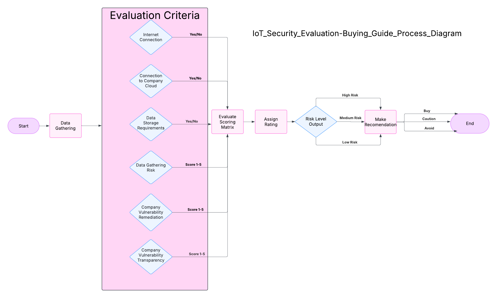

# Privacy and Security of Online Devices
## Problem Statement
Consumers continually purchase IoT devices for relatives and themselves without fully understanding the security risks of always-online connectivity. Most smart home devices such as cameras, doorbells, and appliances are inherently insecure. This is due to weak security protocols in combination with becoming vulnerable over time due to poor update policies, lack of user management, and default settings that go unchanged. With limited access to security-focused information, consumers may unknowingly expose themselves or their families to data breaches, unauthorized access, and cyber threats. This project aims to improve consumer awareness by providing a security-focused buying guide that identifies high-risk IoT categories, analyzes common vulnerabilities, and evaluates manufacturer security practices. By offering clear security information, this guide will help users make informed decisions when buying devices and adopt safer practices for managing IoT devices.

## Project Goals
- Identify categories of IoT devices that pose security risks in home environments and assess their impact on consumer privacy and security.
- Analyze common vulnerabilities such as default credentials, unencrypted data transmissions, and delayed or absent security patches, to help consumers recognize security risks before purchasing.
- Evaluate manufacturer security practices, including update policies and default configurations, to guide consumers in selecting more secure IoT devices.
- Develop a consumer-focused buying guide that provides best practices for selecting, configuring, and maintaining secure IoT devices to reduce the risk of cyber threats.

## Team Meeting times  
- Mondays with Dr Hale: 6:05 - 6:25 
- Mondays: 6:30 - 7:30  
- Thursdays: 6:30 -7:30

# Device Analysis by Category
### [Appliances](Appliances/README.md)
### [Cameras](Cameras/README.md)
### [Entertainment](Entertainment/readme.md)
### [Home Automation](HomeAutomation/README.md)

## Analysis Workflow

## [Timeline](<Project Proposal\Timeline.md>)
| Phase  |  Task Name  |  Start Date  |  End Date  |  Milestone | Status |
| :----: | :---------: | :----------: | :--------: | :--------: | :----: |
| Week 1 |  Identify IoT Device Categories |  Day 1 |  Day 5  | Initial Research Complete | Complete |
| Week 2 |  Create Research Method |  Day 5 |  Day 10 |  Research Method Built | Complete |
| Week 3 |  Gather Case Studies on IoT Vulnerabilities |  Day 10 |  Day 15 |  Security Case Study Compilation | Complete |
| Week 4-5 |  Assessing IoT Security: Weaknesses and Manufacturer Practices |  Day 15 |  Day 25 |  Vulnerability Report | Complete |
| Week 5-6 |  Investigate Consumer IoT Management Challenges |  Day 20 |  Day 30 |  Consumer Awareness Report | In Progress |
| Week 6-7 |  Develop Best Practices for Consumers |  Day 25 |  Day 35 |  Security Guide Draft | Not Started |
| Week 7-8 |  Review and Refine Security Guidelines |  Day 30 |  Day 40  | Final Recommendations | Not Started |
| Week 8-10 |   Finalize Documentation & Publish on GitHub |  Day 35 |  Day 50  | Project Completion | Not Started |

## [Risks](Project Proposal\Risks.md)
|Risk name (value)  | Impact (1-5) | Likelihood (1-5) | Description |
|-------------------|--------------|------------------|-------------|
| Meeting Scheduling (9) | 3 | 3 | The group is spread out accross the different timezones, scheduling our meetings where everyone can reasonably attend may have some issues. |
| Research and Data Collection (12)| 4 | 3 | Finding research on this topic may be scarce and we might not be able to find enough to cover everything that we want to look at. |
| Scope Creep (15) | 3 | 5 | As the project moves along its timeline we may fall into tangents that would cause us to loose time for our main focus. |
| Communication (6) | 3 | 2 | Due to our individual schedules communication will be key for us to get everything done efectively. |
| Evolving Standards (12) | 4 | 3 | Standards are not stagnant, as such they may change which may require us to re-evaluate what we are looking at and change what we are recommending. |

___

## [Progress Report](<Project Checkin/Progress Report.md>)
