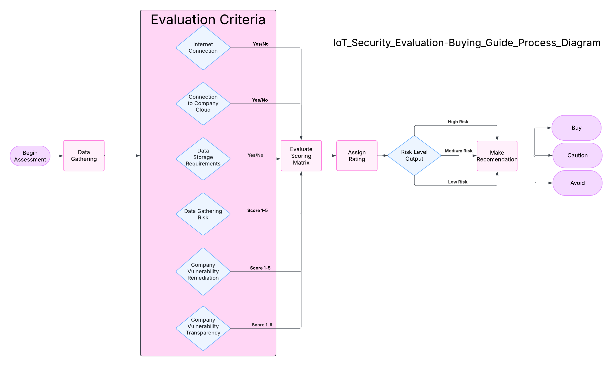

# Privacy and Security of Online Devices
## Problem Statement
Consumers continually purchase IoT devices for relatives and themselves without fully understanding the security risks of always-online connectivity. Most smart home devices such as cameras, doorbells, and appliances are inherently insecure. This is due to weak security protocols in combination with becoming vulnerable over time due to poor update policies, lack of user management, and default settings that go unchanged. With limited access to security-focused information, consumers may unknowingly expose themselves or their families to data breaches, unauthorized access, and cyber threats. This project aims to improve consumer awareness by providing a security-focused buying guide that identifies high-risk IoT categories, analyzes common vulnerabilities, and evaluates manufacturer security practices. By offering clear security information, this guide will help users make informed decisions when buying devices and adopt safer practices for managing IoT devices.

# Device Analysis by Category
### [Appliances](Appliances/README.md)
### [Cameras](Cameras/README.md)
### [Entertainment](Entertainment/readme.md)
### [Home Automation](HomeAutomation/README.md)

# Device Analysis
Device analysis can be completed by following the workflow indicated in the Analysis Workflow image.  The Analysis steps walks through what information to look for to begin working on the device analysis.  Once the analysis is completed the information can be put in the Analysis Matrix below and scored, and then recommendations created.
### [Analysis Steps](<Method/Analysis Steps.md>)
### [Analysis Matrix](<Method/Analysis Matrix.md>)

## Analysis Workflow
